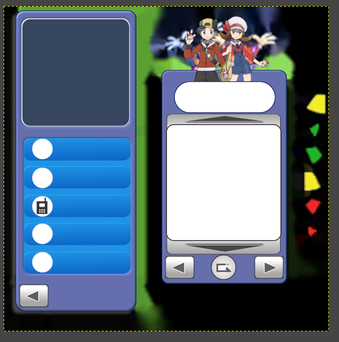
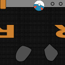

# The Pokémon Content Pack
## *A Pokémon-themed content pack for TTR. Ongoing project.*

### Introduction 
Hello everyone! I'm Princess Wacky Dandywhip (Wacky for short) and this is my first attempt at making a content pack for TTR. I was inspired after hearing some Legendary Pokémon battle music in the VP from another content pack, and this is the result! Please note that this is an ongoing long-term project that isn't my priority right now, so it'll likely be awhile until I have anything that's usable.

*I'm using [Project Bikehorn](https://github.com/toonjoey/toontown-project-bikehorn) as a base. Thanks [toonjoey](https://github.com/toonjoey)!*

### Current priorities
- Finish Cog suits
- Finish identifying where everything is in the phase files
- ~~stop jumping around and pick a section to focus on~~

### Sneak peaks

*The edited Friends List, based off of the PokéGear from HeartGold and SoulSilver. ~~making this in GIMP was a mistake~~*

*The edited Gag Shop sign, inspired by the PokéMart logo from Let's Go Pikachu and Eevee. I didn't realize it was so big - my apologies!*

*Sellbots are Team Rocket! Note: needs to be recreated/adjusted to use Project Bikehorn*
